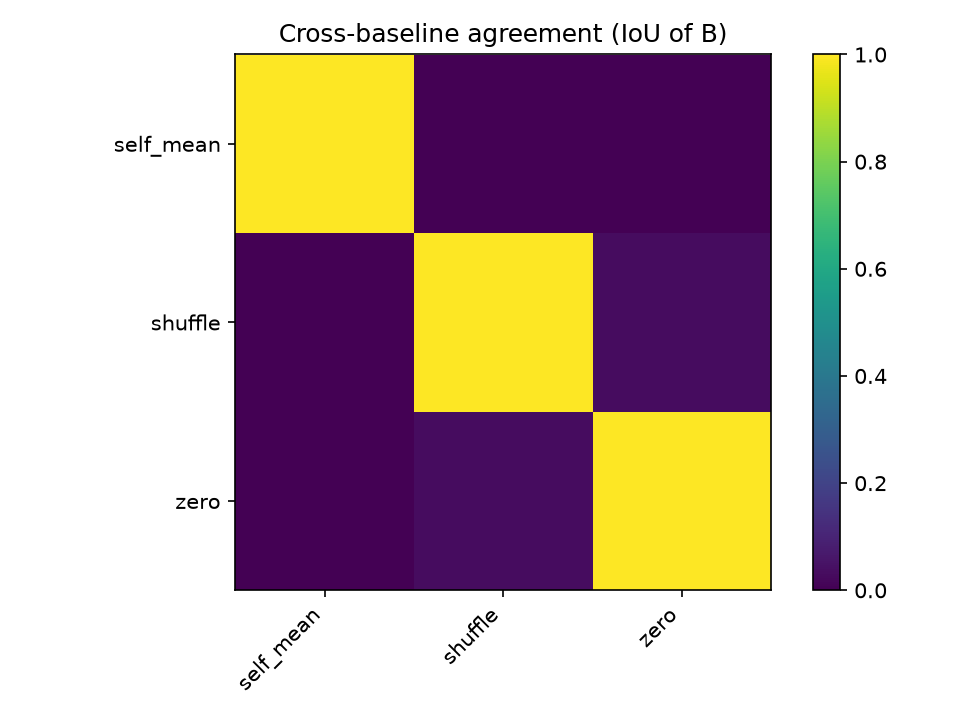
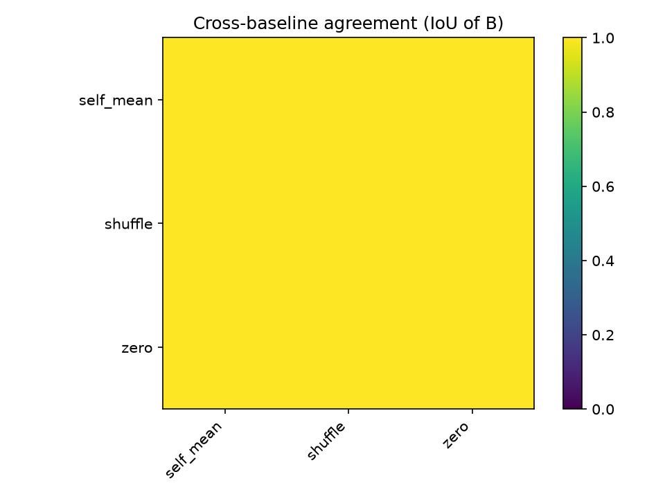
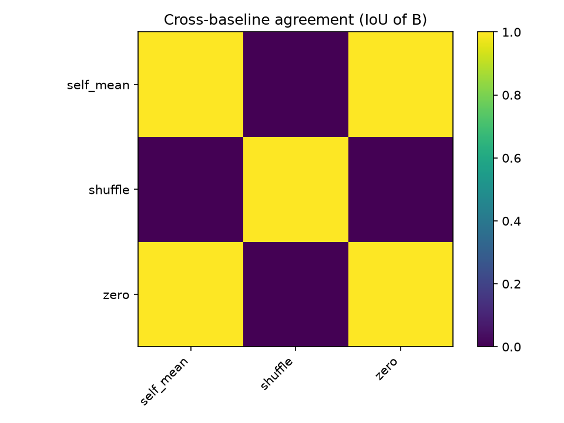
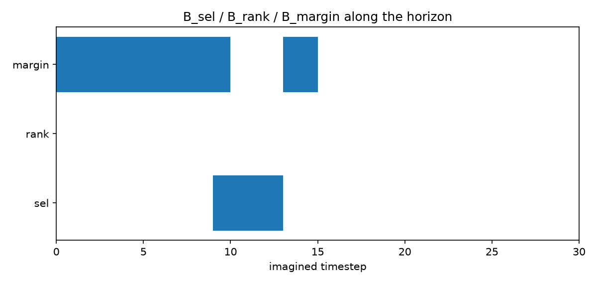
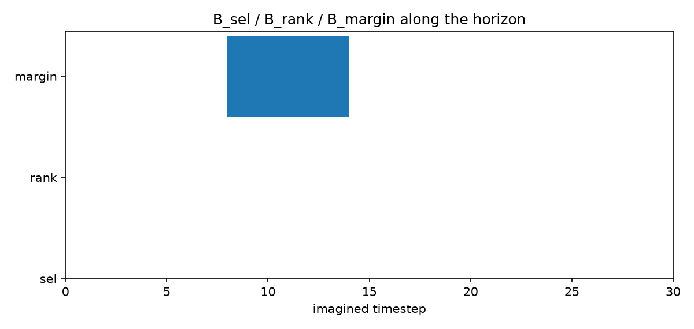

# Results Log

Running log of eval / experiment results for the checkpoints under `models/`.
Append a new dated section each time a new result is worth recording — don't
edit past entries except to fix errors.

---

## 2026-07-14

### Checkpoint sanity-check eval (`dreamerv3/eval.sh`, 50000 steps, GPU 0)

| Task | Metric | Result | Checkpoint |
|---|---|---|---|
| Crafter | Crafter Score (`crafter_score.py`, achievement success rates) | **50.16%** over 22 achievements | `crafter_20260704_130112/20260704T223212F348053` |
| Atari Pong | `episode/score` mean, 16 episodes | **20.375** (min 19.0 / max 21.0) | `atari_pong_20260703_105122/20260704T103718F585051` |
| DMC Walker Walk | `episode/score` mean, 48 episodes | **962.4** (min 898.3 / max 990.3) | `dmc_walker_walk_20260706_113519/20260706T192124F187841` |

Crafter achievement breakdown: 100% on basic-tier (collect_wood/stone/drink/sapling,
place_table/stone/plant/furnace, make_wood_pickaxe/sword, wake_up), 89% collect_coal,
36% defeat_zombie, 37% eat_cow, 5% defeat_skeleton, 0.45% make_stone_pickaxe, and 0%
on the iron/diamond tier (collect_iron/diamond, make_stone_sword, make_iron_pickaxe/sword,
eat_plant) — model mastered the early tech tree but never progressed past it.

Compared against the published DreamerV3 curves bundled in `dreamerv3/scores/*.json.gz`:
- **Pong**: training stopped at step 18,784,560 (target was `5.1e7` in `configs.yaml`,
  likely cut short by the old TSUBAME 24h job limit) — but the eval score already sits in
  the paper's converged range (~20.3–20.8 across seeds at 200M frames), because Pong
  saturates early. **Converged, usable as-is.**
- **Walker Walk**: training completed essentially exactly at target
  (1,095,488 / 1.1e6 steps). Eval score matches the paper's 10-seed converged range
  (~887–991). **Fully converged, best-trained of the three.**
- **Crafter**: no step-count read done (config target `1.1e6`); score reflects a model
  that has NOT explored the deeper tech tree — usable, but imagined rollouts into
  iron/diamond-adjacent states should be treated as low-confidence (RSSM never trained
  on those transitions).

### `worldmodel_explain` pipeline smoke test

First real run of `method/worldmodel_explain/` against these 3 checkpoints.

Config used: `N=8` candidates, `T=30` horizon, `D={1,2,4,8}`, `fill=self_mean` (default
`global_prior` fill is not usable yet — needs offline rollout stats precomputed, see Open
Items below), `objective=H_sel` (`D_sel + λc·R(B)`, `λc=1.0`,
`β_dur=0.01, β_num=0.05, β_sep=0.01, β_dyn=0.05`), `search=greedy forward selection`.

| Task | J (8 candidates, unmasked) | B found | n_evals |
|---|---|---|---|
| Crafter | `[7.004, 6.780, 8.817, 7.633, 7.150, 6.424, 7.494, 6.999]` | `[(4,11), (0,3)]` | 325 |
| Atari Pong | `[2.954, 2.949, 2.979, 2.920, 2.966, 2.908, 2.902, 2.989]` | `[]` (empty) | 110 |
| DMC Walker Walk | `[313.9, 313.9, 320.2, 313.2, 320.8, 315.2, 313.1, 322.5]` | `[]` (empty) | 110 |

This is effectively a check of whether `self_mean` fill forces real work out of the
search. **Crafter passed** (candidates well-separated, J range 6.4–8.8; masking flipped
the argmax, `D_sel(∅)=1`, so search added `[(4,11), (0,3)]` back in). **Pong/Walker
Walk did not** (candidate J's packed within ~0.03–0.09 of each other; even fully-masked
`self_mean` reproduced the original argmax, `D_sel(∅)=0`, so `H_sel(∅)=0` was already the
minimum and search stopped at `B=∅`) — this is the intended §8 sanity check working
correctly, not a pipeline bug: these two decision points just weren't decisive enough.

**Conclusion**: all 3 checkpoints are usable as trained world models for this method —
rollout, scoring, and search all behave sensibly, including correctly flagging the
degenerate `B=∅` cases.

Note: this Crafter run and the §8 diagnostic-experiment Crafter run below sampled
different decision points (different J vectors on the same checkpoint) — decision-point
sampling isn't currently reproducible run-to-run, see Open items.

### §8 diagnostic experiments — first full run, all 3 tasks in parallel (GPU 0/1/3)

Ran all four `method/worldmodel_explain/experiments/*.py` scripts (readme.md §8.1-8.4)
for all three checkpoints in parallel (one GPU each), `fill=self_mean` (per-task config
copies under `worldmodel_explain/config_<task>.yaml`, since `global_prior` still isn't
implemented). Full logs + PNGs under `experiments/out/<task>/`.

**8.1 B=∅ sanity check** (`self_mean`/`shuffle`/`zero` fills, single decision point each):

| Task | self_mean D_sel/D_rank/D_margin | shuffle | zero | Suspect fills? |
|---|---|---|---|---|
| Crafter | 0.000 / 0.250 / 0.924 | 1.000 / 0.357 / 1.455 | 1.000 / 0.571 / 1.945 | none |
| Atari Pong | 0.000 / 0.000 / 0.083 | 0.000 / 0.179 / 0.554 | 0.000 / 0.000 / 0.083 | **all 3** |
| DMC Walker Walk | 1.000 / 0.036 / 0.160 | 1.000 / 0.750 / 4.060 | 0.000 / 0.036 / 0.163 | **zero** |

**Conclusion**: Pong's decision point is degenerate across all three fills (can't
demonstrate the method here). Walker Walk's `zero` fill leaks (consistent with
readme.md §3's known risk); `self_mean`/`shuffle` behave correctly. Crafter: none
flagged.

**8.2 Cross-baseline agreement** (IoU of B across fill strategies, `H_sel`):

| Crafter | Atari Pong | DMC Walker Walk |
|---|---|---|
|  |  |  |

**Conclusion**: Crafter's fills disagree (`self_mean` |B|=0, `shuffle` |B|=1, `zero`
|B|=4 covering the full horizon) — `zero` is the outlier/leaking, not evidence the
method itself is unstable. Pong's "agreement" (all `B=∅`) and Walker Walk's partial
agreement (`self_mean`/`zero` empty, `shuffle` 2/30 covered) are both downstream of the
degenerate-decision-point issue, not genuine cross-baseline robustness.

**8.3 Cross-objective agreement** (`B_sel` vs `B_rank` vs `B_margin`, `self_mean` fill):

| Crafter | Atari Pong | DMC Walker Walk |
|---|---|---|
|  |  |  |

**Conclusion**: Crafter confirms readme.md §5's design assumption — `sel`/`rank`/`margin`
point at genuinely different evidence (`sel=[(9,12)]`, `rank=[]`,
`margin=[(2,9),(13,14),(0,1)]`, pairwise IoU 0.00–0.07). Pong/Walker Walk mostly
collapse to empty/near-identical B across objectives, again downstream of the
degenerate-decision-point issue rather than the objectives being redundant.

**8.4 Cost accounting**: cheap across the board — 0.08-0.79s and 110-743 `G` evaluations
per (fill, objective) combo, all three tasks. `H_margin`/`shuffle` combos are consistently
the most expensive (more segments end up retained → more evals before greedy stops); `sel`
+ `self_mean`/`zero` are the cheapest. No scalability concern at this N=8/T=30 scale.

### Open items (carried over from readme.md §9, still unresolved)

- `global_prior` fill needs an offline-rollout precompute step (`config.yaml`
  `masking.global_prior.rollouts_dir` is empty) — not implemented yet.
- `H_full` and `counterfactual_reimagine` still haven't been exercised by any experiment
  script.
- **Pong and Walker Walk's sampled decision point is degenerate** (candidate J's within
  ~0.03-0.16 of each other) and makes the method's output trivial (`B=∅` or near-empty)
  for most fill/objective combos — this is a decision-point-sampling issue, not a model
  or pipeline bug (Crafter's decision point, by contrast, produced clearly non-trivial,
  differentiated B's across objectives). Next step: sample multiple decision points per
  task (raise `get_decision_point`'s `warmup_steps`, or loop it) and pick/report on ones
  where candidates actually disagree, rather than judging the method on one arbitrary
  frame per task.
- **Decision-point sampling isn't reproducible run-to-run**: the Crafter smoke test and
  the Crafter §8 diagnostic run above used the same checkpoint/config/seed but landed on
  different decision points (different J vectors) — needs investigation before results
  from separate runs can be compared directly.

---

## 2026-07-17

*Tip: decision-point sampling (env reset + policy action sampling) is now
seeded and verified reproducible — the same `(seed, step)` always yields the
same imagined rollout and `J`, for all three tasks.*

*Tip: never run more than one task's `worldmodel_explain` experiment at the
same wall-clock time, even across separate GPUs. First thought to be a small,
Crafter-only, mostly-ignorable drift; a later, broader check (see "Regularizer
strength vs. `H_margin` compactness" and the concurrency check further down)
found it affects all three tasks across every fill/objective combination
tested, sometimes enough to flip a qualitative conclusion. Always run
sequentially — see readme.md §0.*

### Multi-point sampling sweep (`fill=self_mean`, `objective=H_sel`, 35 points/task)

5 env seeds × 7 steps (1/5/10/15/20/25/30) = 35 decision points per task.
Per point: `J range` = max−min candidate score ("how decisive is this
point"), and whether greedy search finds any evidence at all (`B` non-empty).

| Task | Max J range found | Non-empty `B` rate | Reference point |
|---|---|---|---|
| Crafter | 5.72 | 20/35 (57%) | seed=3, step=25 |
| Atari Pong | 0.10 | 11/35 (31%) | seed=2, step=30 |
| DMC Walker Walk | 18.32 | 8/35 (23%) | seed=0, step=25 |

**Conclusions:**

- **Walker Walk is not a degenerate task** (J range up to 18.3 — an order of
  magnitude above the single arbitrary point checked on 2026-07-14), but
  `self_mean` fails *worse* the more decisive the point: all 5 top points by
  J range give `B=∅`; every non-empty `B` in the whole sweep comes from a
  point with J range < 3.5. This is `self_mean`'s self-leakage failure mode
  (readme.md §3) — masking with a trajectory's own mean reconstructs a
  sustained, global signal like Walker Walk's average-velocity return, and
  does so *better* the larger that signal is.
- **Pong's low decisiveness is real** (max J range 0.10 across all 35
  points, uniformly small) — consistent with its near-ceiling eval score,
  not a fill or sampling artifact.
- **Crafter**: `self_mean` works reasonably well (57%), with no such inverse
  relationship between decisiveness and `B` size.

### Fill × objective grid, all 35 decision points per task

Comprehensive version of the diagnostic above: is `self_mean`'s weakness
specific to that one (fill, objective) pair, or does it hold for the other
fills (`shuffle`, `zero`, and — once built, see below — `global_prior`) and
the other two objectives (`H_rank`, `H_margin`)? All 4×3 fill/objective
combinations evaluated on *all 35* decision points per task (not just the
most decisive few — `experiments/fill_objective_sweep.py --top-k 1000`).
`global_prior` uses population-level per-timestep means for `{r, u, d}`,
estimated from ~1000 sampled imagined candidates per task
(`experiments/build_global_prior.py`, saved to
`worldmodel_explain/priors/<task>/prior.npz`, closing the readme.md §9 open
item). Cell = % of the 35 points where greedy search returns a non-empty `B`:

**Crafter**

| fill | H_sel | H_rank | H_margin |
|---|---|---|---|
| self_mean | 54% | 80% | 94% |
| shuffle | 66% | 94% | 97% |
| zero | 71% | 100% | 100% |
| global_prior | 80% | 100% | 97% |

**Atari Pong**

| fill | H_sel | H_rank | H_margin |
|---|---|---|---|
| self_mean | 31% | 46% | 51% |
| shuffle | 66% | 94% | 100% |
| zero | 31% | 46% | 51% |
| global_prior | 94% | 100% | 100% |

**DMC Walker Walk**

| fill | H_sel | H_rank | H_margin |
|---|---|---|---|
| self_mean | 23% | 34% | 80% |
| shuffle | 54% | 91% | 100% |
| zero | 54% | 57% | 94% |
| global_prior | 83% | 100% | 100% |

*(`shuffle`'s numbers move a few points between re-runs — it draws an
unseeded random permutation each call; doesn't change any conclusion below.)*

**Conclusions:**

1. **`global_prior` is the best fill overall, on every task and every
   objective** (`H_sel` 80–94%, `H_rank` 100%, `H_margin` 97–100%) — it fixes
   `self_mean`'s self-leakage failure (readme.md §3): the replacement value
   for a masked step no longer depends on that candidate's own magnitude, so
   it can't "leak" the answer for free.
2. **`global_prior`'s `H_rank` initially measured 0% on every task — a
   metric bug, now fixed.** Fully masking with `global_prior` collapses all 8
   candidates' scores to the *same* value (e.g. `J̃ = [5.838, 5.838, ...]`),
   leaving no pair of candidates to compare. `objectives.d_rank`'s
   Kendall-tau used to default to τ=1 ("ranking preserved") whenever there
   were zero comparable pairs, so a fully-collapsed, uninformative ranking
   scored identically to a perfectly-preserved one and greedy search never
   had a reason to add anything back. Fixed by defaulting to τ=-1
   (worst case) instead — the table above already reflects the fix. Only
   candidate-independent fills ever hit this (`self_mean`/`shuffle`/`zero`
   keep per-candidate structure at `B=∅` and don't).
3. **`self_mean` is the weakest fill on every task/objective**, and
   specifically fails worse the more decisive the point is on Walker Walk:
   restricting to just its 5 most decisive points (J range 7.5–18.3) drops
   its `H_sel` rate to 0% (vs. 23% pooled over all 35) — direct evidence the
   self-leakage effect scales with how much of the signal is a sustained,
   global quantity (Walker Walk's return ≈ average velocity) rather than a
   local event.
4. **`self_mean` and `zero` behave identically on Pong** (identical rates in
   every cell) — Pong's reward is sparse/near-zero at most steps, so masking
   it to zero and masking it to its own mean converge.

**Practical takeaway**: `global_prior` should be the default fill across all
three objectives (already set in the task configs) — it's no longer just the
`H_sel`/`H_margin` recommendation, the `H_rank` weakness was a measurement
artifact, not a real limitation.

### Cross-baseline agreement (readme.md §8.2), `H_sel`, single-point case study

Heatmap of pairwise IoU between the `B`s found by each fill strategy, on one
decision point per task (`experiments/cross_baseline_agreement.py` — this is
a single-point qualitative case study by design, readme.md §8.2; the
aggregate non-empty-`B` rates per fill are the "Fill × objective grid" above).

*Caveat: IoU between two **empty** `B`s is defined as 1.0 (∅ literally equals
∅), which is correct but easy to misread as "these fills found the same
evidence" when really neither found any — check `|B|` before reading a
yellow cell as agreement.*

| Task | Point | self_mean | shuffle | zero | global_prior |
|---|---|---|---|---|---|
| Crafter | seed=3, step=25 | \|B\|=1 | \|B\|=0 | \|B\|=0 | \|B\|=1 |
| Atari Pong | seed=2, step=30 | \|B\|=1 | \|B\|=1 | \|B\|=1 | \|B\|=1 |
| DMC Walker Walk | seed=0, step=5 | \|B\|=1 | \|B\|=1 | \|B\|=1 | \|B\|=1 |

| Crafter | Atari Pong | DMC Walker Walk |
|---|---|---|
|  |  |  |

**Conclusions:**

1. **Crafter**: `self_mean` and `global_prior` agree on the same segment
   (IoU=1.0); `shuffle` and `zero` both return `B=∅` at this point (the
   "agreement" between them is the vacuous empty-set case above, not real
   shared evidence).
2. **Atari Pong**: `self_mean`/`shuffle`/`zero` all agree on the same segment;
   `global_prior` finds a *different* one (IoU=0 vs. the other three) — a
   real, non-trivial disagreement.
3. **DMC Walker Walk**: the task's usual reference point (seed=0, step=25)
   turned out to be degenerate for *every* fill under `H_sel` (`B=∅` across
   the board — an all-yellow, uninformative heatmap, same caveat as above),
   so this case study uses a different, non-degenerate point from the
   35-point sweep (seed=0, step=5) instead. There, `self_mean`/`zero`/
   `global_prior` agree on the same segment and `shuffle` disagrees — same
   qualitative pattern as Crafter (the non-self-referential-but-still-
   candidate-blind fills agreeing, `shuffle`'s destroyed ordering picking out
   something different).
4. `cross_baseline_agreement.py` now takes `--seed`/`--warmup-steps` to target
   a specific decision point instead of only the config's default reference
   point — needed to work around case 3 above, kept as a general option.

### Cross-objective agreement (readme.md §5's planned comparison), `global_prior`

A single point's `B_sel`/`B_rank`/`B_margin` overlap can be an outlier (the
reference-point case study below turned up an IoU of exactly 1.0 for Pong),
so this was run two ways: comprehensively across all 35 sampled decision
points per task, and as a single-point qualitative case study with a
timeline visualization.

**Comprehensive (35 points/task, `experiments/cross_objective_agreement_sweep.py`):**

| Task | mean \|B_sel\| | mean \|B_rank\| | mean \|B_margin\| | sel↔rank IoU (mean/median) | sel↔margin IoU | rank↔margin IoU |
|---|---|---|---|---|---|---|
| Crafter | 4.3 | 12.2 | 14.4 | 0.14 / 0.00 | 0.12 / 0.03 | 0.27 / 0.20 |
| Atari Pong | 1.0 | 1.7 | 29.7 | 0.08 / 0.00 | 0.04 / 0.03 | 0.06 / 0.03 |
| DMC Walker Walk | 3.3 | 10.5 | 27.7 | 0.13 / 0.00 | 0.11 / 0.07 | 0.38 / 0.27 |

**Conclusions:**

1. **`|B_sel| < |B_rank| < |B_margin|` holds on average, on every task** —
   confirms readme.md §5's expected size ordering, but **`H_margin`'s large
   `B` is mostly degenerate, not a genuinely larger-but-still-compact
   explanation.** Mean `B_margin` coverage is 99% of the horizon for Pong,
   92% for Walker Walk, 48% for Crafter — i.e. for Pong/Walker Walk, `H_margin`
   almost always ends up keeping nearly *everything*. With nearly nothing
   masked, `J̃ ≈ J` trivially, so `D_sel`/`D_rank`/`D_margin` are all trivially
   near their best values too — this isn't "evidence found," it's the
   objective being satisfied by not really masking anything. Root cause:
   readme.md §6 mandates the *same* regularizer weights (`β_dur=0.01` etc.,
   `λc=1.0`) across all three objectives for a fair size comparison, but
   `D_margin` is a relative-error quantity where keeping one more real
   timestep almost always buys a real, non-negligible improvement — the
   `β_dur=0.01`-scale cost of covering one more step is far too cheap to stop
   greedy search before it's covered nearly all of `T`. See "Regularizer
   strength vs. `H_margin` compactness" below for how sensitive this is to
   the regularizer weights. Crafter's lower average (48%) shows this isn't
   universal — the failure mode is specific to how much of Pong's/Walker
   Walk's return is a *sustained* signal (nothing to gain from masking a
   sustained trend, so keep it all) vs. Crafter's more localized rewards.
2. **The three objectives mostly surface different evidence** — median IoU
   is 0.00–0.27 for every pair, on every task. `rank↔margin` is consistently
   the most overlapping pair (0.20–0.38 median) — plausible since `H_margin`
   is the strictest constraint and its evidence set most often ends up
   covering whatever `H_rank` already needed, plus more.
3. **Pong's sel==rank coincidence (IoU=1.0) at its reference point is real
   but uncommon** — happens at 2/35 points for Pong, 1/35 for Walker Walk,
   0/35 for Crafter. Not a general pattern, just occasionally true.
4. **`B_sel` is empty** at 7/35 (20%) Crafter points, 6/35 (17%) Walker Walk,
   2/35 (6%) Pong — matches the `global_prior` `H_sel` non-empty rates from
   the fill × objective grid above almost exactly (80%/83%/94% non-empty ⟺
   20%/17%/6% empty), a good cross-check between the two experiments.

**Single-point case study** (reference decision point, `experiments/cross_objective_agreement.py`).
**Caveat confirmed directly: `B_margin` covers 100% of the 30-step horizon
(0–29) at all three points below** — a clean illustration of conclusion 1,
not three genuinely-informative margin explanations.

| Task | `B_sel` | `B_rank` | `B_margin` (covers 30/30 in all 3 cases) |
|---|---|---|---|
| Crafter | `[(29,29)]` | `[(15,16),(17,20)]` | `[(0,7),(8,15),(15,22),(22,29)]` |
| Atari Pong | `[(7,7)]` | `[(7,7)]` | `[(0,0),(1,8),(9,16),(14,21),(22,29)]` |
| DMC Walker Walk | `[]` | `[(28,29)]` | `[(0,7),(6,13),(14,21),(22,29)]` |

| Crafter | Atari Pong | DMC Walker Walk |
|---|---|---|
|  |  |  |

Walker Walk's `B_sel` happens to be empty at this specific reference point
(one of its 6/35 empty cases) — not a useful point for an `H_sel` case study
on this task; a different point from the 35-point sweep should be picked if
one is needed for a write-up figure.

### Regularizer strength vs. `H_margin` compactness

Follow-up to the near-full-horizon `B_margin` finding above: does simply
strengthening the regularizer (readme.md §6's `β_dur/β_num/β_sep/β_dyn`,
scaled together by a multiplier — equivalent to scaling `λc`, since `R(B)` is
linear in the betas) recover a compact `B_margin`? First tried a coarse
multiplier grid (1/3/10/30/100) and initially concluded there was no middle
ground, only a cliff between ×3 and ×10 — that conclusion turned out to be
an artifact of the coarse spacing skipping over the transition. Re-ran with a
finer grid (1–20) and **evaluated each task independently rather than
assuming one multiplier has to work for all three** — the transition point is
genuinely different per task. Mean coverage (of `T=30`) / mean `D_margin` at
the search's final `B`, `global_prior` fill, all 35 points per task:

*Re-run solo/sequentially (no concurrent GPU jobs) after the concurrency
issue below turned out to affect margin computations more than expected —
see "Case study with randomly-selected points" for the full story. Checked
this population-level (35-point mean) version against its original
concurrent-run numbers directly: **Walker Walk was identical, Pong nearly
identical (only ×9/×10 shifted, consistent with the single-point finding that
concurrency made Pong transition about one multiplier step early), Crafter
shifted more (drops noticeably faster in the solo version) but the same
qualitative shape held up.** Averaging over 35 points evidently washes out
most of the concurrency noise that seriously corrupted individual-point
checks — this table was already fairly reliable, unlike the single-point
case studies. Numbers below are the solo-verified ones.*

| Multiplier | Crafter cov / D_margin | Pong cov / D_margin | Walker Walk cov / D_margin |
|---|---|---|---|
| ×1 (baseline) | 14.6/30 / 0.41 | 29.8/30 / 0.00 | 27.7/30 / 0.03 |
| ×2 | 13.4/30 / 0.44 | 29.8/30 / 0.00 | 27.8/30 / 0.03 |
| ×3 | 12.1/30 / 0.51 | 29.8/30 / 0.00 | 27.8/30 / 0.03 |
| ×4 | 10.3/30 / 0.59 | 29.8/30 / 0.00 | 24.4/30 / 0.15 |
| ×5 | 8.7/30 / 0.68 | 29.8/30 / 0.00 | 21.5/30 / 0.25 |
| ×6 | 5.7/30 / 0.81 | 29.8/30 / 0.00 | 15.5/30 / 0.48 |
| ×7 | 2.5/30 / 1.01 | 27.3/30 / 0.10 | 13.8/30 / 0.55 |
| ×8 | 0.6/30 / 1.09 | 24.3/30 / 0.21 | 9.1/30 / 0.71 |
| ×9 | 0.5/30 / 1.11 | 20.1/30 / 0.37 | 4.3/30 / 0.92 |
| ×10 | 0.2/30 / 1.12 | 11.1/30 / 0.72 | 3.8/30 / 0.94 |
| ×11 | 0.0/30 / 1.14 | 6.8/30 / 0.88 | 2.9/30 / 0.97 |
| ×12 | 0.0/30 / 1.14 | 3.4/30 / 1.01 | 2.5/30 / 0.99 |
| ×13 | 0.0/30 / 1.14 | 1.7/30 / 1.08 | 2.1/30 / 1.02 |
| ×14 | 0.0/30 / 1.14 | 0.0/30 / 1.14 | 1.2/30 / 1.06 |
| ×15 | 0.0/30 / 1.14 | 0.0/30 / 1.14 | 1.1/30 / 1.06 |
| ×20 | 0.0/30 / 1.14 | 0.0/30 / 1.14 | 0.0/30 / 1.14 |

**Corrected conclusion: there is a real, usable middle ground — the earlier
"cliff" (from the very first coarse 1/3/10/30/100 grid) was a sampling
artifact, not a property of `D_margin`.** All three tasks show a genuine
gradual decline in the *mean* coverage, not a step function. But **the
transition happens at a different multiplier for each task, so a shared
multiplier across tasks isn't the right framing** (readme.md §6's
"same weights for a fair comparison" applies to comparing `H_sel`/`H_rank`/
`H_margin` *within* a task, not to reusing one `H_margin` compactness
setting *across* tasks): Pong needs the strongest push (flat through ×6,
only starts declining at ×7); Crafter responds fastest (already declining by
×2); Walker Walk is in between.

**But a smooth mean does not imply any individual point degrades smoothly —
checked the actual per-point distribution behind these means, not just the
mean itself, and it differs sharply by task:**

Points per coverage bucket (0–4 / 5–9 / 10–14 / 15–19 / 20–24 / 25–30), out of
35, at a few representative multipliers (full breakdown at all 16
multipliers: `experiments/out/*_margin_regularizer_sweep_hist_solo.log`):

| Multiplier | Crafter | Pong | Walker Walk |
|---|---|---|---|
| ×1 | 6 / 7 / 7 / 5 / 1 / 9 | 0 / 0 / 0 / 0 / 0 / **35** | 0 / 0 / 1 / 4 / 1 / 29 |
| ×9 | 33 / 2 / 0 / 0 / 0 / 0 | **11** / 0 / 0 / 1 / 0 / **23** | 27 / 1 / 1 / 4 / 0 / 2 |
| ×10 | 34 / 1 / 0 / 0 / 0 / 0 | **22** / 0 / 0 / 0 / 0 / **13** | 28 / 1 / 1 / 3 / 0 / 2 |

- **Pong's distribution is essentially bimodal at every multiplier**: at
  ×9, 23/35 points are still fully covered (25–30 bucket) and 11/35 have
  already collapsed to near-empty (0–4), with only **1** point anywhere in
  between. The population mean (20.1/30) is not a "typical point" value —
  it is purely the *proportion* of points that have flipped, averaged
  against those that haven't. Turning the multiplier up on Pong doesn't
  make individual explanations more compact; it changes what *fraction* of
  decision points get a compact-or-empty explanation instead of a full one.
- **Crafter's distribution is genuinely spread, not bimodal**: at ×1 the 35
  points are spread fairly evenly across all six buckets (6/7/7/5/1/9), and
  the whole distribution shifts left together as the multiplier increases,
  rather than splitting into two piles. The population mean here **is**
  representative of what a typical point looks like.
- **Walker Walk is in between**: mostly concentrated at the extremes like
  Pong, but with a small, persistent cluster in the 15–19 bucket across many
  multipliers (this is where the stable, compact (seed=3,step=5) point from
  the case study below lives) — a genuine minority of points that behave
  like Crafter's smooth case, sitting inside an otherwise Pong-like bimodal
  majority.

**Practical takeaway, revised**: a per-task regularizer multiplier (roughly
×3–5 for Crafter, ×5–7 for Walker Walk, ×9–10 for Pong) is still the right
per-task recommendation for the *population*, but what it buys differs by
task. For **Crafter**, tuning genuinely makes a typical explanation more
compact. For **Pong**, tuning mostly just trades off how many decision points
get a (usually near-empty) explanation vs. a full one — it will rarely land
an arbitrary point on a nice intermediate `B_margin`. **Walker Walk** is
mixed: works well for the minority of points with real intermediate
structure, bimodal for the rest.

### Case study with randomly-selected points, not the max-`J`-range one

The reference points used everywhere above (picked by "largest `J` range"
back in the first multi-point sweep) are a biased choice for a case study —
"largest `J` range" was the right criterion for its original purpose
(showing a task isn't degenerate), but not for "what does a representative
`H_margin` explanation look like." Drew **3 points per task genuinely at
random** (Python's `random`, OS entropy, no cherry-picking) and ran the full
regularizer-multiplier sweep (×1–20, `experiments/margin_regularizer_sweep.py`
on a single point at a time) on each individually, instead of just an
×1-vs-one-tuned-value snapshot:

*Correction: this sweep was first run with all three tasks concurrently (one
GPU each) — the same concurrency-noise phenomenon flagged earlier in this
doc, but far more consequential here, since these margin computations sit
right at a sharp per-point threshold (see below) where even small numerical
noise flips the qualitative outcome rather than just nudging a number.
Re-ran all 9 points solo/sequentially (single process, no concurrent GPU
jobs at all) after noticing Pong's concurrent-run numbers didn't reproduce on
a spot-check; two of Crafter's three points changed substantially between the
concurrent and solo runs (one point's "before" coverage was 30/30 concurrent
vs. 13–14/30 solo; a reported non-monotonic anomaly at another point
disappeared entirely under the solo re-run, i.e. it was a concurrency
artifact, not a real property of greedy search). Numbers below are the
solo-verified ones.*

| Task | Point (seed,step) | Coverage @×1 | Behavior across ×1–20 |
|---|---|---|---|
| Crafter | (4,25) | 13/30 | rises slightly to 14/30 at ×2–6, clean jump to 0/30 at ×7 |
| Crafter | (2,25) | 10/30 | flat at ×1–2, partial step to 2/30 at ×3, 0/30 from ×4 |
| Crafter | (4,30) | 30/30 | flat through ×4, clean jump to 0/30 at ×5 |
| Atari Pong | (3,20) | 30/30 | flat through ×9, clean jump to 0/30 at ×10 |
| Atari Pong | (4,1) | 30/30 | flat through ×9, clean jump to 0/30 at ×10 |
| Atari Pong | (0,5) | 29/30 | flat through ×9, clean jump to 0/30 at ×10 |
| Walker Walk | (1,25) | 30/30 | flat through ×10, clean jump to 0/30 by ×12 |
| Walker Walk | (3,5) | 14/30 | **stable and compact** at 14/30 across ×1–8, drops to 0/30 at ×9 |
| Walker Walk | (4,25) | 30/30 | flat through ×5, clean jump to 0/30 at ×6 |

Timeline images for one representative point per task:
`images/crafter/cross_objective_agreement_random2.png` (seed=2,step=25),
`images/atari_pong/cross_objective_agreement_random2.png` (seed=4,step=1),
`images/dmc_walker_walk/cross_objective_agreement_random2.png` (seed=3,step=5).
(Generated as standalone solo runs, unaffected by the concurrency issue above.)

**Conclusions:**

1. **6 of 9 randomly-drawn points are pure step functions** — flat at a
   constant coverage, then a single clean jump straight to `B=∅` at a
   point-specific multiplier threshold that varies a lot even within one
   task (Walker Walk's three points jump between ×5–6, ×8–9, and ×10–12).
2. **2 of 9 points are naturally compact and *stable* across a wide
   multiplier range, no tuning needed**: Crafter (4,25) sits at 13–14/30
   through ×1–6, and Walker Walk (3,5) sits at 14/30 through ×1–8 — both
   genuinely non-degenerate, tuning-robust `H_margin` explanations.
3. **1 of 9 points, Crafter (2,25), shows a real (if brief) intermediate
   step**: 10/30 at ×1–2, then 2/30 at ×3, then 0/30 from ×4 — a genuine
   3-level transition rather than a single binary jump, though still fast.

**Calibrated takeaway**: representative (random) points confirm the
population-level story — most individual points are either already fine or
flip to empty at their own threshold, and only a minority (here 3/9) give a
genuinely compact, non-degenerate `B_margin` without needing to hit exactly
the right multiplier. `H_margin` explanations should be presented with this
caveat; Walker Walk (3,5) and Crafter (4,25) are the cleanest illustrative
examples found so far if a compact case is needed for a write-up.

**Methodological note**: any future analysis of margin-regularizer behavior
near a threshold must run solo/sequentially from the start — this isn't
optional caution, it's what this exact re-run just demonstrated: concurrent
GPU noise was large enough here to fabricate a "non-monotonic" finding out of
thin air and to misreport one point's coverage by more than 2x. (Superseded
by an even broader finding below — this isn't specific to margin or to
thresholds.)

### Do `H_sel`/`H_rank` need the same regularizer treatment as `H_margin`? And does it hold across all fills?

Extended the regularizer-multiplier × distribution analysis from `H_margin`
only to all 4 fills × 3 objectives (`experiments/regularizer_grid_sweep.py`,
35 points/task, solo/sequential — see the concurrency finding below for why
solo was non-negotiable here). Mean `B` coverage (of `T=30`) at the
**baseline ×1 weights**, no tuning:

**Crafter**

| fill | H_sel | H_rank | H_margin |
|---|---|---|---|
| self_mean | 4.3 | 10.1 | 11.4 |
| shuffle | 1.5 | 6.7 | 20.0 |
| zero | 8.8 | 19.4 | 19.9 |
| global_prior | 4.1 | 9.3 | 14.4 |

**Atari Pong**

| fill | H_sel | H_rank | H_margin |
|---|---|---|---|
| self_mean | 0.3 | 1.1 | 4.6 |
| shuffle | 0.8 | 3.7 | 23.7 |
| zero | 0.3 | 1.1 | 4.6 |
| global_prior | 1.1 | 2.1 | 29.8 |

**DMC Walker Walk**

| fill | H_sel | H_rank | H_margin |
|---|---|---|---|
| self_mean | 1.0 | 1.7 | 5.0 |
| shuffle | 1.8 | 6.6 | 18.5 |
| zero | 3.4 | 5.7 | 16.2 |
| global_prior | 3.3 | 10.5 | 27.7 |

**Answer: no, `H_sel`/`H_rank` don't need it — they're already compact at the
default weights, for every fill and every task.** `H_margin` is consistently
the largest by a wide margin (pun noted), confirming the
`|B_sel| < |B_rank| < |B_margin|` ordering holds in raw size, not just
non-empty rate, across all 12 fill/objective combinations, not only
`global_prior`. `H_margin`'s near-full-horizon degeneracy (Pong/Walker Walk
especially) was a real, `H_margin`-specific problem; `H_sel`/`H_rank` never
exhibited it, so the regularizer-tuning investigation done for `H_margin`
doesn't need to be repeated for them — increasing their regularizer weight
would only shrink an already-small `B`, not fix a degeneracy that isn't there.

**Is `H_sel`/`H_rank`'s `B` also bimodal (only ever ~0 or ~30), the way
`H_margin` was for Pong?** Checked the actual per-point coverage
distribution (buckets of 5, out of 35 points, at ×1) behind the means
above, not just the means — the answer is no, that pattern is specific to
`H_margin`, not a general property:

| Fill / objective | Crafter | Atari Pong | Walker Walk |
|---|---|---|---|
| self_mean / sel | 21/8/3/3/0/0 | **35**/0/0/0/0/0 | 32/2/1/0/0/0 |
| self_mean / rank | 13/7/6/4/0/5 | 33/1/1/0/0/0 | 29/4/2/0/0/0 |
| zero / rank | 2/3/11/3/3/13 | 33/1/1/0/0/0 | 18/8/4/5/0/0 |
| global_prior / rank | 15/8/4/3/0/5 | 32/3/0/0/0/0 | 9/13/4/5/1/3 |

(buckets: 0–4 / 5–9 / 10–14 / 15–19 / 20–24 / 25–30; full 12-combo breakdown
in `experiments/out/*_regularizer_grid_SOLO.log`)

- **Crafter is genuinely spread, not bimodal**: e.g. `zero`+`H_rank` has real
  mass in *every* bucket (2/3/11/3/3/13) — a middle-heavy distribution with
  some points also fully covered, not a full/empty split.
- **Pong is unimodal at the low end, not bimodal**: e.g. `self_mean`+`H_sel`
  has literally all 35 points in the 0–4 bucket — everything stays small,
  there's no cluster of full-coverage points to be bimodal *against*. This
  is different from Pong's `H_margin` behavior (which really was full-vs-
  empty bimodal) and consistent with Pong's decisions being uniformly
  low-stakes (established earlier) rather than "some decisive, some not."
- **Walker Walk is in between**: mostly concentrated low like Pong, but with
  more genuine spread into middle/high buckets, especially for `H_rank`.

So the `H_margin`-specific "only ever full or empty" pattern found for Pong
does not generalize to `H_sel`/`H_rank` — it's tied to what makes `D_margin`
uniquely sensitive to masking (readme.md §3), not a property of the search
or the task in general.

**A second, much bigger finding came out of running this grid, which
supersedes earlier, narrower concurrency notes in this doc**: to sanity-check
whether concurrent GPU execution was safe for this broader grid, ran it once
concurrently (3 tasks, 1 GPU each, same wall-clock time) and once
solo/sequentially, then diffed every cell. **Every one of the 12 fill ×
objective combinations differed between the concurrent and solo runs, for
all three tasks** — not just Crafter, not just `H_margin`, not just points
near a threshold. Differences ranged from negligible to substantial (e.g.
Walker Walk `self_mean`+`H_sel` mean coverage: 23.1 concurrent vs. 18.5
solo). The earlier belief that "Pong and Walker Walk are robust to
concurrency" was based only on the simple `self_mean`/`global_prior` @ ×1
sweep from earlier in this doc — it does not generalize to a grid this size.
**Revised, unconditional rule: never run more than one task's
`worldmodel_explain` experiment at the same wall-clock time, regardless of
task, fill, objective, or whether anything looks threshold-sensitive.**
readme.md §0 updated accordingly.

### Open items (updated)

- ~~Decision-point sampling isn't reproducible run-to-run~~ — **resolved**.
- ~~Pong and Walker Walk's sampled decision point is degenerate~~ — **resolved
  for Walker Walk** (it isn't degenerate; `self_mean` leakage was masking
  that). **Still true for Pong**, confirmed to be a property of the
  task/checkpoint rather than a sampling issue.
- ~~`global_prior` fill needs an offline-rollout precompute step~~ —
  **resolved**, see "Fill × objective grid, all 35 decision points per task" above.
- ~~`D_rank`'s tie-breaking makes it structurally blind to candidate-independent
  fills like `global_prior`~~ — **resolved**, see conclusion 2 above.
- ~~Cross-objective agreement hasn't been re-run against the new reference
  points / `global_prior`~~ — **resolved**, see "Cross-objective agreement" above.
- ~~`cross_baseline_agreement.py`'s heatmap hasn't been re-run against the new
  reference points / `global_prior`~~ — **resolved**, see "Cross-baseline
  agreement" above.
- ~~`H_margin`'s large `B` is mostly degenerate (near-full-horizon coverage,
  especially Pong/Walker Walk) with the shared (×1) regularizer weights~~ —
  **partially resolved**: a per-task regularizer multiplier (×3–5 for
  Crafter, ×5–7 for Walker Walk, ×9–10 for Pong) recovers a genuinely compact
  `B_margin` *on average* — see "Regularizer strength vs. `H_margin`
  compactness" and "Case study with randomly-selected points" above.
  **Caveat**: not a guaranteed per-point fix — 6/9 randomly-drawn points are
  pure step functions with their own threshold, so the tuned multiplier can
  still land a specific point on the wrong side (full or empty) rather than
  a nice middle; only 3/9 random points were genuinely compact without
  hitting an exact threshold. Not yet adopted as the actual per-task config
  default (still ×1 everywhere).
- ~~`H_full` and `counterfactual_reimagine` still haven't been exercised by any
  experiment script~~ -- **`counterfactual_reimagine` resolved**, see
  "2026-07-20" below. `H_full` still not exercised.
- The §8 cost-accounting experiment hasn't been re-run against the new
  reference points / `global_prior` yet.
- `shuffle`'s fill is unseeded (fresh RNG per call, see note above) — low
  priority (doesn't change conclusions) but worth seeding if exact numbers
  need to match run-to-run.
- ~~Concurrent GPU execution's numerical drift is Crafter-specific / only
  matters near a regularizer threshold~~ — **superseded, worse than
  thought**: affects all three tasks across every fill/objective combo
  tested (see "Do `H_sel`/`H_rank` need the same regularizer treatment"
  above). Not a bug to fix — the operational rule (never run tasks
  concurrently) is now unconditional, in readme.md §0.
- Root cause of the concurrency-induced numerical drift itself (leading
  guess from 2026-07-17: GPU/host contention changing cuDNN/XLA kernel
  selection) is still not confirmed — not chased further, since the
  workaround (never run concurrently) is simple and now well-established.

---

## 2026-07-20

### `counterfactual_reimagine` exercised for the first time (readme.md §3/§8)

`masking.counterfactual_reimagine` was implemented earlier but had never
actually been run by any `experiments/*.py` script (both readme.md §8.2 and
the open items above flagged this). Added
`experiments/counterfactual_case_study.py`: rather than running full greedy
search under this fill (readme.md §3's "most expensive... not full search" --
`search.greedy_forward_selection` would call it once per candidate segment at
every step, and each distinct masked-run length triggers a fresh JIT compile
inside `dyn.imagine`, since length is baked in as a static shape), it runs the
config's cheap default fill's search *once* to get the same reference `B` the
main-line results already report, then evaluates only `B=∅` and that fixed
`B_ref` under every fill including `counterfactual_reimagine` -- O(1)
`dyn.imagine` calls instead of O(|pool|²).

**Two latent bugs surfaced immediately on first use** (exactly the kind of
thing "never exercised by any script" predicts):

1. `branch_carry`'s `put` helper called `np.asarray(x)` unconditionally
   before `device_put`. For the `start==0` branch, `x` is the live
   `dyn_carry` (already a `jax.Array` on-device), so this forced an explicit
   device-to-host read and tripped the project-wide
   `jax_transfer_guard='disallow'` ("Disallowed device-to-host transfer") --
   the same class of guard `rollout.to_numpy` already has to work around
   for a different call site. Fixed by only routing through `np.asarray`
   when `x` isn't already a `jax.Array`.
2. `branch_carry(start=0)` passed `dyn_carry` -- batch size 1, the single
   `h0` belief state -- straight into `dyn.imagine` without tiling it to `N`
   candidates first, unlike `rollout._rollout_impl`'s own `_tile(dyn_carry,
   n)` for the main (non-counterfactual) rollout. Caused a concatenate shape
   mismatch inside `dreamerv3/rssm.py`'s `_core` (`(1,1024)` vs `(8,1024)`)
   the moment a masked run started at `t=0`. Fixed by tiling to `N` via
   `rollout._tile` before `device_put`.

Both fixed in `masking.py`; see comments there for detail.

### Case studies, all 3 tasks (sequential, one GPU, per §0)

`B_ref` found by `global_prior` + `H_sel` (the task configs' actual default),
`B=∅` as the no-evidence-retained anchor. Reference points: Crafter
(seed=3, step=25, the usual reference point), Pong (seed=2, step=30, its
usual reference point -- `B_ref=[(7,7)]` matches the single-point case study
from 2026-07-17 exactly), Walker Walk (seed=0, step=5 -- its *usual*
reference point, seed=0/step=25, is the documented degenerate `H_sel` case
from 2026-07-17, so this non-degenerate point from the 35-point sweep was
used instead, same substitution `cross_baseline_agreement.py` already made).

| Task | `B_ref` | `D_sel`/`D_rank`/`D_margin` @ `B=∅` | @ `B_ref` | `counterfactual_reimagine` cost |
|---|---|---|---|---|
| Crafter | `[(29,29)]`, 1/30 | 1.000 / 0.571 / 1.190 | 0.000 / 0.357 / 1.115 | 2.48s (∅) / 2.66s (`B_ref`) |
| Atari Pong | `[(7,7)]`, 1/30 | 1.000 / 0.250 / 1.106 | 0.000 / 0.250 / 0.540 | 2.42s (∅) / 4.70s (`B_ref`) |
| DMC Walker Walk | `[(25,29)]`, 5/30 | 1.000 / 0.393 / 1.937 | 1.000 / 0.643 / 2.135 | 2.33s (∅) / 2.20s (`B_ref`) |

(Full per-fill breakdown, including `self_mean`/`shuffle`/`zero`/`global_prior`
at both `B`'s, in `experiments/out/<task>/counterfactual_case_study.log`.)

Timeline plots (original vs. every fill's reconstruction of the top candidate's
`rhat`/`uhat`, masked region shaded) in
`images/<task>/counterfactual_case_study.png`.

**Qualitative conclusions** (the actual point of this experiment, per readme.md
§3's "avoids OOD inputs to `G`" rationale -- `D`-metric numbers above are a
side effect, not the goal, since a single fixed `B` on one point was never
meant to be a search-quality comparison):

- **Walker Walk is the clearest illustration**: under the no-op default
  action, `counterfactual_reimagine`'s reconstructed value trace *falls* from
  ~320 to ~298 over the masked region, tracking what looks like a
  genuinely different but physically coherent alternative (the walker
  losing momentum without the actual policy's action) -- the static fills
  (`self_mean`/`global_prior`/`zero`) all just hold a constant near the
  original's neighborhood instead, which is the self-referential/OOD failure
  mode readme.md §3 describes: a flat imputed number can't represent "this
  alternative genuinely diverges."
- **Pong**: `counterfactual_reimagine`'s value trace stays close to the
  original's smooth upward trend, unlike `global_prior`'s fill which visibly
  drifts off-trend -- consistent with Pong's low-decisiveness story (2026-07-17):
  the no-op action doesn't change much because the decision itself barely
  matters here.
- **Crafter**: `counterfactual_reimagine` produces a materially lower,
  independently-varying value trajectory than the actual-action rollout
  (which has a sharp reward spike near the end that the no-op branch never
  reproduces) -- again a *different, structured* alternative, not a flat
  baseline.
- **Cost**: 2.2-4.7s per `masked_Y` call (a handful of `dyn.imagine` calls,
  each with its own JIT compile for that masked-run length) vs. ~0.00s for
  every other fill -- confirms readme.md §3's "most expensive" framing and
  why it's excluded from `search.greedy_forward_selection`'s main sweep
  (§7 would call this once per candidate segment at *every* greedy step,
  i.e. hundreds of these compiles, not a handful).

**Caveat, addressed below, and an important framing correction**: the above
is one decision point per task (n=1) -- not enough to generalize. It's also
tempting to read a disagreement between a cheap fill and
`counterfactual_reimagine` as "the cheap fill's `B` was wrong, caught out by
the more faithful method." **That framing is wrong and should not be used.**
`counterfactual_reimagine` is not a ground truth / answer key here: it
answers a genuinely different question from `self_mean`/`global_prior`/
`zero`/`shuffle`. Those four approximate "this information is unknown /
removed" (a marginalization-style baseline); `counterfactual_reimagine`
instead substitutes one specific alternative intervention (a fixed no-op
action), and only for the masked run itself --
`masking.counterfactual_reimagine`'s own docstring notes it does not
propagate the counterfactual branch forward past the next kept segment, i.e.
it doesn't claim to be a fully re-coherent alternative trajectory either. A
disagreement between it and another fill means what §8.2's
`cross_baseline_agreement.py` already established for the other four fills:
**different masking semantics can disagree about whether a given `B` looks
decision-faithful** -- it is not evidence that either fill is "wrong." At
this single Walker Walk point, `global_prior`'s own re-scoring of its `B_ref`
gave `D_sel=0` while `counterfactual_reimagine`'s re-scoring of the *same*
`B_ref` gave `D_sel=1` -- a real disagreement between two different masking
semantics, but n=1 isn't enough to say whether that generalizes. See below
for a 3-points/task follow-up.

### Cross-fill disagreement on a fixed `B_ref`, extending §8.2 to `counterfactual_reimagine` (3 points/task)

Follow-up to the single-point disagreement above. Added
`experiments/counterfactual_case_study_sweep.py`: reuses the 3
genuinely-random points per task already drawn for the regularizer-multiplier
case study ("Case study with randomly-selected points", 2026-07-17 --
picked via Python's `random`, no cherry-picking) rather than a fresh arbitrary
sample. n=9 total (3/task) is still far too small for a real statistical
claim -- this reports a rough "how often do these two masking semantics
disagree" rate, not a significance test, and (per the correction above) it is
**not** a test of which fill is correct. One agent load per task
(`pipeline.points_to_decisions`), so cost stays small (a handful of
`dyn.imagine` calls per point).

For each point: find `B_ref` with the task's normal search fill
(`global_prior` + `H_sel`), then re-score that *same* fixed `B_ref` under
every cheap fill (`self_mean`/`shuffle`/`zero`/`global_prior`) and under
`counterfactual_reimagine`, and compare pairwise -- not just against the fill
that found `B_ref`, since that comparison is free once
`counterfactual_reimagine` has been run once per point (same `Y_tilde`'s, no
extra GPU calls). `disagreement_rate` = fraction of the 3 points where
`D_sel` differs between the cheap fill's re-scoring and
`counterfactual_reimagine`'s; `mean Δrank`/`mean Δmargin` = mean
(`counterfactual_reimagine`'s `D_rank`/`D_margin` − the cheap fill's) -- the
sign only says which of the two masking semantics happens to look more/less
faithful on this particular `B`/point, **not** which one is right.

| Task | fill | disagreement_rate | mean Δrank | mean Δmargin |
|---|---|---|---|---|
| Crafter | self_mean | 33% | 0.036 | −1.124 |
| Crafter | shuffle | 67% | 0.071 | −1.375 |
| Crafter | zero | 0% | −0.119 | −1.517 |
| Crafter | global_prior | 67% | −0.345 | −0.156 |
| Atari Pong | self_mean | 67% | 0.310 | 1.021 |
| Atari Pong | shuffle | 67% | 0.238 | 0.402 |
| Atari Pong | zero | 67% | 0.310 | 1.021 |
| Atari Pong | global_prior | 33% | 0.103 | 0.130 |
| DMC Walker Walk | self_mean | 100% | 0.488 | 7.081 |
| DMC Walker Walk | shuffle | 67% | 0.357 | 6.095 |
| DMC Walker Walk | zero | 67% | 0.405 | 6.653 |
| DMC Walker Walk | global_prior | 100% | 0.030 | 6.284 |

(Per-point rows in `experiments/out/<task>/counterfactual_case_study_sweep.log`.)

**Conclusions (n=3/task -- directional, not statistically powered, and about
disagreement between masking semantics, not correctness of either one):**

1. **The single-point Walker Walk disagreement generalizes, and by a wide
   margin**: every fill's mean `|Δmargin|` on Walker Walk (6.1-7.1) is 4-40x
   larger than the corresponding fill's on Crafter or Pong (all under 1.6),
   and 3/4 fills disagree with `counterfactual_reimagine` on `D_sel` on at
   least 2/3 points (`self_mean`/`global_prior` on all 3). This is now a
   task-level pattern across 3 independent points -- fill choice matters far
   more for Walker Walk explanations than for the other two tasks -- not a
   property of the one point checked above.
2. **Crafter goes the *opposite* direction**: every fill's mean `Δmargin` on
   Crafter is *negative* -- `counterfactual_reimagine`'s re-scoring of the
   same `B_ref` looks *more* faithful there, not less. If
   `counterfactual_reimagine` were some kind of ground truth that cheap fills
   either matched or fell short of, you'd expect the sign to point the same
   way across tasks; it doesn't. That's itself the useful takeaway here:
   **this is symmetric disagreement between two different masking
   assumptions, not a one-directional error pattern in the cheap fills.**
3. **`global_prior` (the recommended default, readme.md §3) happens to be
   closest to `counterfactual_reimagine`'s re-scoring on 2/3 tasks**: lowest
   disagreement_rate and smallest \|Δrank\|/\|Δmargin\| on Atari Pong (33%,
   0.103, 0.130 -- smallest of the 4 fills), and by far the smallest `Δrank`
   on Walker Walk (0.030 vs 0.36-0.49 for the others), though its `Δmargin`
   there is still large (the task-level effect from point 1, not
   fill-specific). Crafter is the exception: `global_prior` has the
   *largest*-magnitude `Δrank` there (−0.345). Framed carefully: this is weak
   (n=3) evidence that `global_prior`'s explanations are the most *stable*
   across masking semantics on this checkpoint set, not evidence that it is
   the most "correct" -- `counterfactual_reimagine` was never established as
   the reference to be correct relative to.
4. **Not a substitute for a real sweep, and not a correctness benchmark even
   with more points**: 9 points total is enough to show the Walker Walk
   pattern isn't a one-off and that the sign isn't universal, but not enough
   to fit a per-task disagreement rate with confidence -- and no amount of
   points turns this into a "which fill is right" experiment, since there is
   no ground-truth fill in this design (readme.md §3 lists five *candidate*
   masking strategies to compare, not four approximations of a fifth, exact
   one). If this needs to be load-bearing for a write-up, extend
   `CASE_STUDY_POINTS` (or point selection generally) before trusting the
   exact percentages above, and keep describing it as cross-fill
   disagreement, not error.

### Scaling the disagreement sweep to the standard 35-points/task grid

The n=3/task pilot above explicitly flagged its own percentages as
untrustworthy. `counterfactual_case_study_sweep.py` now defaults to the
project's standard 35-point grid (5 seeds x 7 steps, matching
`sample_decision_points.py`/`fill_objective_sweep.py`/
`cross_objective_agreement_sweep.py`) instead of the original 3
genuinely-random points/task (kept as `CASE_STUDY_POINTS`, reproducible via
`--points`) -- same method otherwise: find `B_ref` with the task's normal
search fill (`global_prior` + `H_sel`), re-score that fixed `B_ref` under
every cheap fill and under `counterfactual_reimagine`, compare. Same
"disagreement, not correctness" caveat as above applies throughout --
`counterfactual_reimagine` is still not a ground truth here.

| Task | fill | disagree_rate | mean Δrank | mean Δmargin |
|---|---|---|---|---|
| Crafter | self_mean | 43% | 0.212 | −0.055 |
| Crafter | shuffle | 46% | 0.168 | −0.570 |
| Crafter | zero | 26% | 0.012 | −0.475 |
| Crafter | global_prior | 71% | −0.058 | −0.007 |
| Atari Pong | self_mean | 54% | 0.243 | 1.166 |
| Atari Pong | shuffle | 40% | 0.049 | 0.404 |
| Atari Pong | zero | 54% | 0.243 | 1.166 |
| Atari Pong | global_prior | 60% | 0.090 | 0.326 |
| DMC Walker Walk | self_mean | 74% | 0.408 | 11.403 |
| DMC Walker Walk | shuffle | 46% | 0.261 | 10.805 |
| DMC Walker Walk | zero | 63% | 0.343 | 11.162 |
| DMC Walker Walk | global_prior | 80% | 0.079 | 10.769 |

(Per-point rows in `experiments/out/<task>/counterfactual_case_study_sweep_35pt.log`.)

**Conclusions (n=35/task, replaces the n=3 pilot's numbers above -- the n=3
qualitative shape claims from the section above still stand, only the
specific percentages there should now be discarded):**

1. **Walker Walk's outsized disagreement is confirmed, not a fluke of 3
   points, and is even larger at real scale**: mean `|Δmargin|` on Walker
   Walk (10.7-11.4) is 9-40x every fill's `|Δmargin|` on Crafter (≤0.57) or
   Pong (≤1.17). This is now a robust task-level pattern across all 35
   points, not 3.
2. **Crafter's sign reversal also holds at scale**: every fill's mean
   `Δmargin` on Crafter stays negative at n=35 (was negative at n=3 too), the
   only task where this direction holds -- confirms the earlier read that
   disagreement direction is task-dependent, not fill-dependent, and
   definitely not evidence of a one-directional "cheap fills are
   overconfident" effect.
3. **The n=3 pilot's specific rates were unreliable, exactly as flagged, and
   in one case the direction of a conclusion flips outright**: the n=3
   pilot's conclusion #3 ("`global_prior` looks like the most
   reimagine-robust cheap fill on 2/3 tasks") **does not hold at n=35 and is
   superseded** -- `global_prior` in fact has the *highest* `disagree_rate`
   of all four fills on **all three tasks** (71%/60%/80%), not the lowest.
   This is a clean demonstration of exactly why n=3 wasn't trustworthy for
   exact rates or fill rankings, and a concrete reminder not to read n=3-level
   findings in this doc as final without a follow-up sweep.
4. **Why `global_prior` having the highest disagree_rate does *not* mean
   "`global_prior` is worse" (reinforcing the disagreement-not-correctness
   framing)**: `B_ref` is found by searching *with* `global_prior` itself
   under `H_sel`, so `global_prior`'s own re-scoring of `B_ref` is, by
   construction, close to whatever `D_sel` the search already drove toward
   (typically near 0 whenever search succeeds) -- so `global_prior`'s
   disagree_rate here is essentially measuring how often
   `counterfactual_reimagine`'s specific no-op-action reconstruction flips
   the argmax relative to what the *search itself* already decided, not a
   defect in `global_prior`'s masking semantics relative to the other three
   fills. The other three fills' `B_ref` re-scoring isn't anchored the same
   way (they didn't find `B_ref`), so their disagree_rates aren't measuring
   quite the same thing -- another reason not to rank fills by this number.
5. **Mean `Δrank` stays small and near zero for every fill on Crafter/Pong**
   (|0.01-0.24|) but is uniformly larger on Walker Walk (0.08-0.41) -- rank
   preservation, not just margin, is also where masking-semantics choice
   matters most for this task.

### Three new fill strategies added: `interpolate`, `candidate_swap`, `retrieval`

Brainstormed beyond readme.md §3's original five (self_mean/global_prior/
zero/shuffle/counterfactual_reimagine) and implemented in `masking.py`,
wired into `pipeline.Decision` and every `experiments/*.py` `FILLS` dict.
readme.md §3's table now documents all three; `config.yaml`'s
`masking.fill` comment updated.

- **`interpolate`**: linear interpolation between the nearest kept
  timesteps before/after each masked run (per-candidate, clamped at horizon
  edges via `np.interp`). Pure numpy. Falls back to `self_mean` when `B=∅`.
  Safe for `d̂` (unlike `zero`) -- interpolates between two real continuation
  values, can't manufacture forced termination.
- **`candidate_swap`**: replaces candidate `i`'s masked-out timesteps with
  candidate `j≠i`'s REAL values there (one shared random derangement drawn
  once per `masked_Y` call and reused across `r̂`/`û`/`d̂`, so the swapped-in
  region tells one coherent alternate candidate's story, not a per-signal
  mix). Complements `shuffle`: `shuffle` tests whether *timing/order* within
  a candidate's own values matters; `candidate_swap` tests whether the
  segment's content is specific to *this* candidate at all.
- **`retrieval`**: per-candidate nearest-neighbor lookup against the offline
  bank `global_prior`'s mean is estimated from (L2 distance on the *kept*
  timesteps only), filling masked steps with the closest bank member's
  values there -- a context-sensitive alternative to `global_prior`'s single
  population-wide constant. Requires the offline bank (raw, unaveraged
  samples), which `experiments/build_global_prior.py` now also saves as
  `bank.npz` (via new `masking.save_prior_bank`/`load_prior_bank`) alongside
  the existing `prior.npz` -- no extra rollouts, the samples already exist
  in memory when the mean is computed. Falls back to the bank mean (≈
  `global_prior`) when `B=∅`.

Re-ran `build_global_prior.py` for all 3 tasks to produce `bank.npz`
(solo/sequential, one GPU, per §0). **Side finding: the rebuild is not
perfectly reproducible even without concurrency** -- Crafter's re-estimated
`prior.npz` mean differs from the original by ~0.5-1% relative (e.g.
`r[1]`: 0.10229 → 0.10154), Walker Walk drifted by a much smaller amount
(~0.01-0.1%), and Pong reproduced bit-for-bit exactly. This is a *different*
phenomenon from the concurrency-induced drift already documented above (that
one specifically requires concurrent GPU jobs; this rebuild was solo) --
noted here, not chased further, consistent with this doc's existing stance
on the concurrency drift's root cause.

**Validation** (`sanity_check_empty_B.py` + `cross_baseline_agreement.py`,
all 3 tasks, solo/sequential): both new fills run cleanly end-to-end, no
crashes, on every task.

- `retrieval` tracks `global_prior` almost exactly wherever checked: same
  `D_sel`/`D_rank`/`D_margin` at `B=∅` on all 3 tasks (expected -- same
  fallback-to-bank-mean path), and IoU=1.00 with `global_prior`'s found `B`
  on Crafter and Walker Walk's reference points. Diverges from it on Pong's
  reference point (IoU=0.00, each finds a different single segment) --
  consistent with readme.md §8.2's existing finding that Pong is exactly
  where `global_prior` and the candidate-blind fills tend to disagree.
- `candidate_swap` is consistently the harshest fill: largest `D_margin` at
  `B=∅` on every task (1.541 Crafter / 2.245 Pong / 1.927 Walker Walk, vs.
  ≤1.14 for every other fill), needs the most coverage to satisfy `H_sel` on
  Crafter (`|B|=4`, 20/30 covered, vs. `|B|=1` for self_mean/global_prior/
  interpolate/retrieval), and is the *only* fill that finds non-trivial
  evidence (`D_sel=1`, `|B|=1` non-empty) at Walker Walk's known-degenerate
  reference point (seed=0/step=25, flagged degenerate under `H_sel` for
  every other fill since 2026-07-17) -- replacing a candidate wholesale with
  a different real candidate's trajectory is evidently a much more
  decision-disruptive intervention than any of the statistic-based fills.

Full logs: `experiments/out/<task>/`; heatmaps:
`images/<task>/cross_baseline_agreement_v2.png`.

**All 7 fills' standalone finding, updated** (`fill_objective_sweep.py
--top-k 1000`, 35 points/task, non-empty-`B` rate by objective --
originally run with 5 fills before `candidate_swap`/`retrieval` existed,
re-run with all 7 once both were added to `fill_objective_sweep.FILLS`):

| Task | fill | sel | rank | margin |
|---|---|---|---|---|
| Crafter | self_mean | 57% | 77% | 94% |
| Crafter | shuffle | 60% | 94% | 100% |
| Crafter | zero | 66% | 100% | 100% |
| Crafter | global_prior | 80% | 100% | 97% |
| Crafter | interpolate | 60% | 54% | 77% |
| Crafter | **candidate_swap** | **100%** | **97%** | **100%** |
| Crafter | **retrieval** | **80%** | **100%** | **26%** |
| Atari Pong | self_mean | 31% | 46% | 51% |
| Atari Pong | shuffle | 74% | 97% | 100% |
| Atari Pong | zero | 31% | 46% | 51% |
| Atari Pong | global_prior | 94% | 100% | 100% |
| Atari Pong | interpolate | 31% | 37% | 6% |
| Atari Pong | **candidate_swap** | **97%** | **100%** | **100%** |
| Atari Pong | **retrieval** | **94%** | **100%** | **100%** |
| DMC Walker Walk | self_mean | 14% | 37% | 77% |
| DMC Walker Walk | shuffle | 51% | 83% | 100% |
| DMC Walker Walk | zero | 37% | 60% | 97% |
| DMC Walker Walk | global_prior | 80% | 100% | 100% |
| DMC Walker Walk | interpolate | 14% | 23% | 20% |
| DMC Walker Walk | **candidate_swap** | **100%** | **100%** | **100%** |
| DMC Walker Walk | **retrieval** | **80%** | **100%** | **94%** |

(`shuffle`'s numbers move a few points between re-runs, same unseeded-RNG
caveat as 2026-07-17; small shifts vs. the single-point checks above are
this, not a bug.)

`interpolate`'s non-empty-`B` rate is consistently the lowest or
near-lowest of all 7 fills, most strikingly on `margin` (Pong 6% vs. 51-100%
for the others; Walker Walk 20% vs. 77-100%). Plausible reading, not fully
chased down: local linear interpolation from real per-candidate anchors
already looks "good enough" to `G` even from very little retained evidence,
so greedy search has less to gain by adding more -- the opposite failure
mode from `self_mean`'s self-leakage (readme.md §3), but likewise a form of
the fill making `B=∅`-or-near-empty look artificially sufficient. Worth a
`sanity_check_empty_B.py`-style flag if `interpolate` is used for real
search results, not just `counterfactual_reimagine`-style case studies.

**`candidate_swap` needs by far the most coverage of any fill, on every task
and every objective** (97-100% non-empty across the board) -- confirms the
single-point finding above (harshest `D_margin` at `B=∅`) now backed by 35
points/task: replacing a candidate with a different real candidate's
trajectory destroys decision structure so thoroughly that search almost
always has to retain something to compensate, regardless of task or
objective.

**`retrieval` tracks `global_prior` closely on `sel`/`rank` on every task
(identical or within a few points), but its `margin` rate diverges sharply
on Crafter specifically** (26% vs. `global_prior`'s 97% -- a 71-point gap,
while Pong and Walker Walk's `retrieval`/`global_prior` `margin` rates are
close, 100/100 and 94/100 respectively). Not chased down further -- flagged
here as a fill-specific, task-specific oddity rather than explained, since
it's the one cell that breaks an otherwise consistent "retrieval ≈
global_prior" pattern across all other (task, objective) combinations.

### `candidate_swap`/`retrieval`: coverage-bucket distribution + single-point case studies

Follow-up to the 7-fill non-empty-`B`-rate table above -- that table only
says *whether* search added anything, not the resulting `D` value or how
coverage is actually distributed across points. Ran
`experiments/regularizer_grid_sweep.py --fills candidate_swap,retrieval` (35
points/task, all 3 objectives, the same 10-multiplier grid and
`COV_BINS = (0,5,10,15,20,25,31)` bucketing used for the original 4 fills on
2026-07-17) plus one `cross_objective_agreement.py` case study per fill per
task (reuses the existing script/reference points unchanged, just with
`--fill candidate_swap` / `--fill retrieval`).

**`retrieval` + `H_sel`: a strong, consistent finding across all 3
tasks.** At baseline-to-moderate regularizer strength, mean `D_sel` is
**exactly 0.000** on every task (only drifting off zero once the multiplier
gets aggressive enough to start cutting useful segments -- ×15 on Crafter,
×9 on Walker Walk, not until ×20 on Pong), while mean coverage stays tiny
(1.1-2.7/30) and almost every point lands in the 0-4 bucket. `retrieval`
essentially always finds a small, fully decision-preserving explanation
under `H_sel` -- a stronger property than any of the other 6 fills
demonstrate at this objective (compare the 7-fill table's `sel` column,
where even `global_prior` only reaches 80-94% *non-empty*, not "always fully
correct").

**`candidate_swap` + `H_sel`: the opposite pattern, and worse on Pong than
the other two tasks.** Mean `D_sel` never approaches 0 on any task even at
the highest multipliers tested (before search gives up entirely and
collapses to `B=∅` at ×20) -- Crafter 0.43-0.66, Walker Walk 0.43-0.74, and
Pong notably worse at 0.71-0.91 with coverage that stays small throughout
(~2-3/30, never grows past that even at ×1). This is a different failure
mode from "needs more coverage" (the 7-fill table's near-100% non-empty
rate): even with real segments retained, replacing the rest with a
*different real candidate's* trajectory apparently changes the imagined
argmax often enough that `H_sel` frequently can't be satisfied at all on
this checkpoint set, worst on Pong specifically.

**`margin`'s bimodal-vs-spread split by task (2026-07-17's finding) also
holds for both new fills, not just the original four.** Crafter's `margin`
coverage distributions stay comparatively spread across buckets at every
multiplier for both fills; Pong and Walker Walk's both show real mass at
*both* extremes (0-4 and 25-30) simultaneously, e.g. `candidate_swap`
margin ×1: Pong `8/6/4/3/1/13`, Walker Walk `3/8/5/3/0/16` -- consistent with
the task being the driver of bimodal-vs-spread `H_margin` behavior, not the
choice of fill.

**Single-point case studies** (`images/<task>/cross_objective_agreement_{candidate_swap,retrieval}.png`):

| Task | `candidate_swap` (`B_rank` / `B_margin`) | `retrieval` (`B_rank` / `B_margin`) |
|---|---|---|
| Crafter | `[(15,22),(22,22)]` / 5 segments, near-full horizon | `[(13,20),(10,13)]` / `[(9,16),(5,8),(17,18),(23,23)]` |
| Atari Pong | `[(28,29),(15,18)]` / 6 segments spanning most of horizon | `[(0,0)]` / `[(8,15),(29,29),(7,7)]` |
| DMC Walker Walk | `[(22,29),(17,24),(10,17),(2,9),(0,1)]` / 6 segments, `B_rank`≡`B_margin` (IoU=1.00) | `[(22,29)]` / `[(17,18)]` |

Walker Walk's case study point is the *same* reference point flagged
degenerate under `H_sel` for every other fill since 2026-07-17
(seed=0/step=25) -- `candidate_swap` is not degenerate there at all
(`B_rank`/`B_margin` both cover almost the entire 30-step horizon, and are
identical to each other), reinforcing the 7-fill table's finding that it's
the only fill non-empty at this specific point. `retrieval` stays compact
even here (`[(22,29)]`, `[(17,18)]`), consistent with its `sel`-objective
efficiency generalizing to not needing large explanations elsewhere either.

Full logs: `experiments/out/<task>/regularizer_grid_swap_retrieval.log`.

### Open items (updated)

- ~~`counterfactual_reimagine` still hasn't been exercised by any experiment
  script~~ -- **resolved**, see above (two latent bugs fixed in `masking.py`
  along the way).
- `H_full` still hasn't been exercised by any experiment script.
- ~~`candidate_swap`/`retrieval` have only been checked via
  `sanity_check_empty_B`/`cross_baseline_agreement` (single reference
  point/task)~~ -- **resolved**, see the updated 7-fill table above (all 3
  tasks, 35 points/task) and the coverage-bucket distribution + case study
  section above.
- `retrieval`'s Crafter-specific `margin` divergence from `global_prior`
  (26% vs. 97%, this section) isn't explained -- the one cell that breaks an
  otherwise consistent "retrieval ≈ global_prior" pattern.
- `candidate_swap`'s `H_sel` failure being notably worse on Pong specifically
  (mean `D_sel` 0.71-0.91 vs. 0.43-0.74 on the other two tasks) isn't
  explained -- flagged, not chased down.
- `build_global_prior.py`'s solo (non-concurrent) non-determinism (this
  section) is a new, distinct finding from the already-documented
  concurrency-induced drift -- root cause not investigated.
