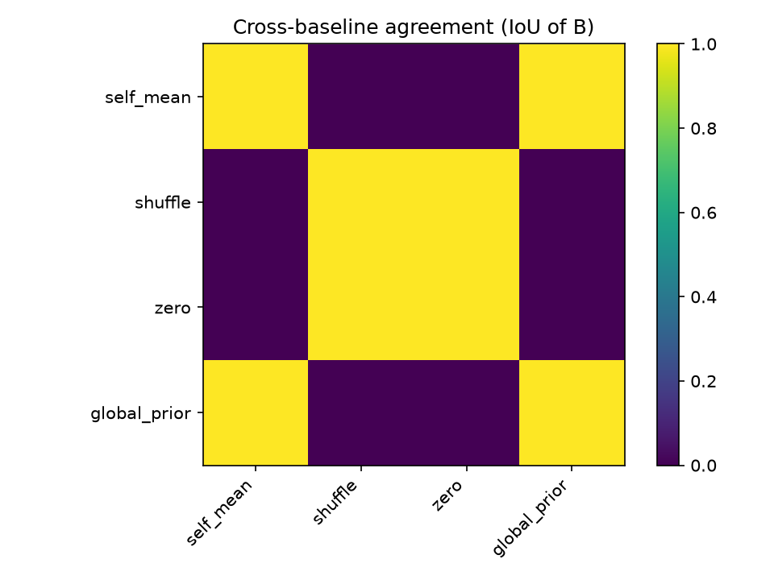
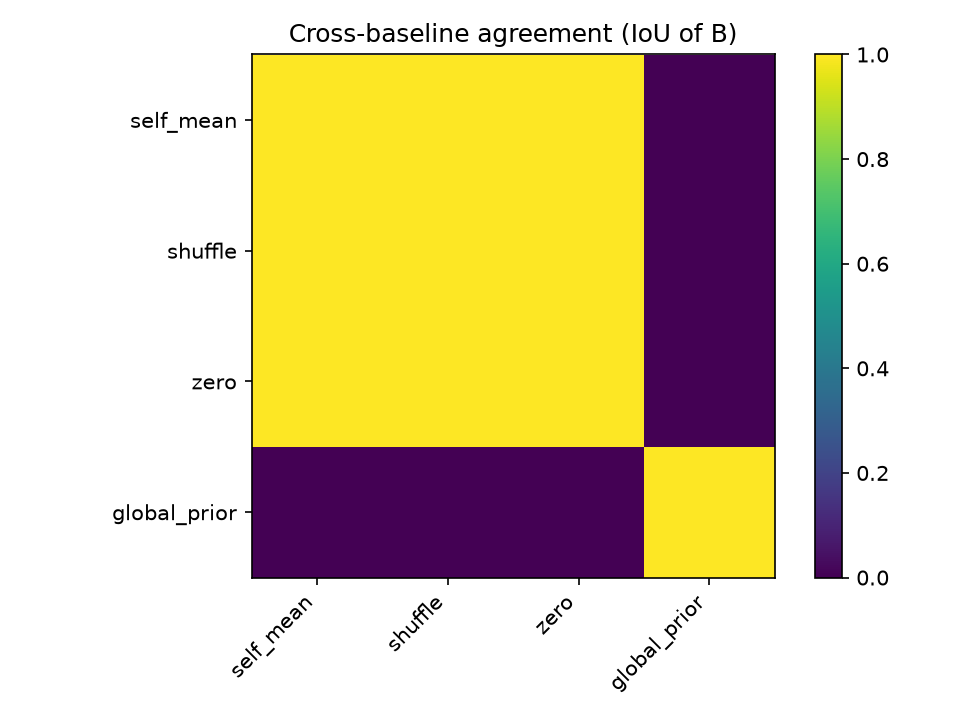
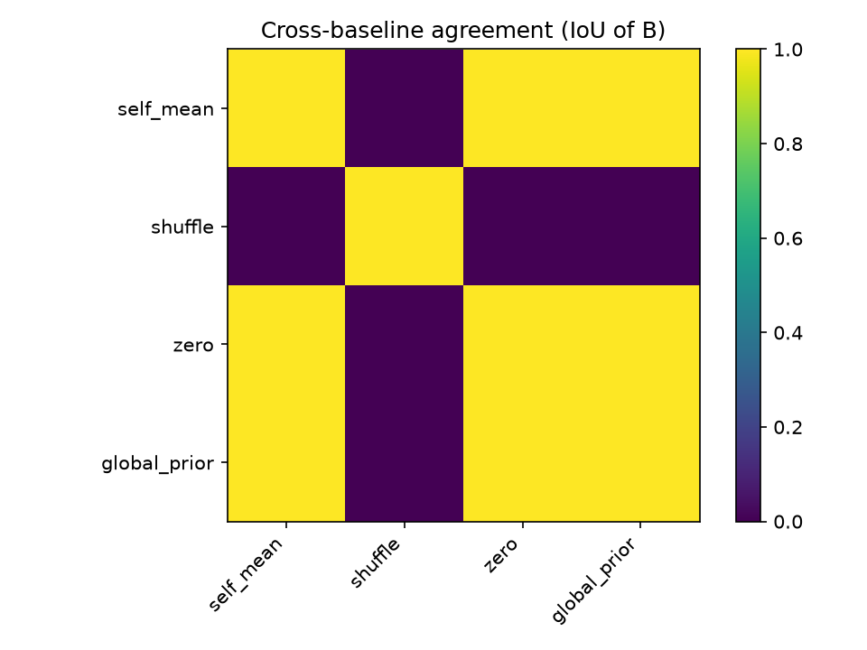
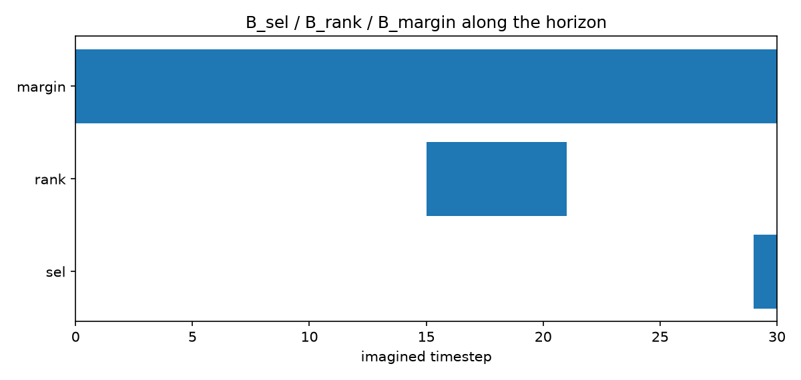
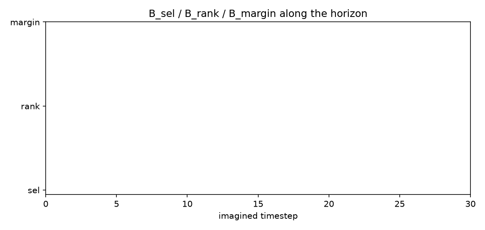
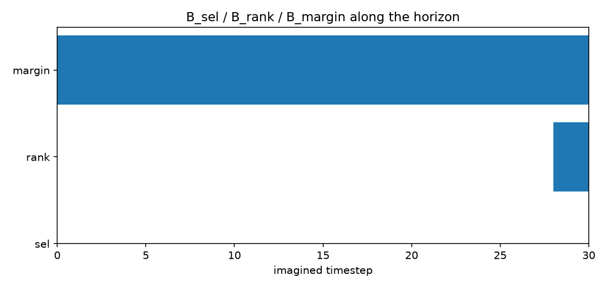

# Results Log

Running log of eval / experiment results for the checkpoints under `models/`.
Append a new dated section each time a new result is worth recording — don't
edit past entries except to fix errors.

---

## 2026-07-14

### Checkpoint sanity-check eval (`dreamerv3/eval.sh`, 50000 steps, GPU 0)

| Task | Metric | Result | Checkpoint |
|---|---|---|---|
| Crafter | Crafter Score (`crafter_score.py`, achievement success rates) | **50.16%** over 22 achievements | `crafter_20260704_130112/20260704T223212F348053` |
| Atari Pong | `episode/score` mean, 16 episodes | **20.375** (min 19.0 / max 21.0) | `atari_pong_20260703_105122/20260704T103718F585051` |
| DMC Walker Walk | `episode/score` mean, 48 episodes | **962.4** (min 898.3 / max 990.3) | `dmc_walker_walk_20260706_113519/20260706T192124F187841` |

Crafter achievement breakdown: 100% on basic-tier (collect_wood/stone/drink/sapling,
place_table/stone/plant/furnace, make_wood_pickaxe/sword, wake_up), 89% collect_coal,
36% defeat_zombie, 37% eat_cow, 5% defeat_skeleton, 0.45% make_stone_pickaxe, and 0%
on the iron/diamond tier (collect_iron/diamond, make_stone_sword, make_iron_pickaxe/sword,
eat_plant) — model mastered the early tech tree but never progressed past it.

Compared against the published DreamerV3 curves bundled in `dreamerv3/scores/*.json.gz`:
- **Pong**: training stopped at step 18,784,560 (target was `5.1e7` in `configs.yaml`,
  likely cut short by the old TSUBAME 24h job limit) — but the eval score already sits in
  the paper's converged range (~20.3–20.8 across seeds at 200M frames), because Pong
  saturates early. **Converged, usable as-is.**
- **Walker Walk**: training completed essentially exactly at target
  (1,095,488 / 1.1e6 steps). Eval score matches the paper's 10-seed converged range
  (~887–991). **Fully converged, best-trained of the three.**
- **Crafter**: no step-count read done (config target `1.1e6`); score reflects a model
  that has NOT explored the deeper tech tree — usable, but imagined rollouts into
  iron/diamond-adjacent states should be treated as low-confidence (RSSM never trained
  on those transitions).

### `worldmodel_explain` pipeline smoke test

First real run of `method/worldmodel_explain/` against these 3 checkpoints.

Config used: `N=8` candidates, `T=30` horizon, `D={1,2,4,8}`, `fill=self_mean` (default
`global_prior` fill is not usable yet — needs offline rollout stats precomputed, see Open
Items below), `objective=H_sel` (`D_sel + λc·R(B)`, `λc=1.0`,
`β_dur=0.01, β_num=0.05, β_sep=0.01, β_dyn=0.05`), `search=greedy forward selection`.

| Task | J (8 candidates, unmasked) | B found | n_evals |
|---|---|---|---|
| Crafter | `[7.004, 6.780, 8.817, 7.633, 7.150, 6.424, 7.494, 6.999]` | `[(4,11), (0,3)]` | 325 |
| Atari Pong | `[2.954, 2.949, 2.979, 2.920, 2.966, 2.908, 2.902, 2.989]` | `[]` (empty) | 110 |
| DMC Walker Walk | `[313.9, 313.9, 320.2, 313.2, 320.8, 315.2, 313.1, 322.5]` | `[]` (empty) | 110 |

This is effectively a check of whether `self_mean` fill forces real work out of the
search. **Crafter passed** (candidates well-separated, J range 6.4–8.8; masking flipped
the argmax, `D_sel(∅)=1`, so search added `[(4,11), (0,3)]` back in). **Pong/Walker
Walk did not** (candidate J's packed within ~0.03–0.09 of each other; even fully-masked
`self_mean` reproduced the original argmax, `D_sel(∅)=0`, so `H_sel(∅)=0` was already the
minimum and search stopped at `B=∅`) — this is the intended §8 sanity check working
correctly, not a pipeline bug: these two decision points just weren't decisive enough.

**Conclusion**: all 3 checkpoints are usable as trained world models for this method —
rollout, scoring, and search all behave sensibly, including correctly flagging the
degenerate `B=∅` cases.

Note: this Crafter run and the §8 diagnostic-experiment Crafter run below sampled
different decision points (different J vectors on the same checkpoint) — decision-point
sampling isn't currently reproducible run-to-run, see Open items.

### §8 diagnostic experiments — first full run, all 3 tasks in parallel (GPU 0/1/3)

Ran all four `method/worldmodel_explain/experiments/*.py` scripts (readme.md §8.1-8.4)
for all three checkpoints in parallel (one GPU each), `fill=self_mean` (per-task config
copies under `worldmodel_explain/config_<task>.yaml`, since `global_prior` still isn't
implemented). Full logs + PNGs under `experiments/out/<task>/`.

**8.1 B=∅ sanity check** (`self_mean`/`shuffle`/`zero` fills, single decision point each):

| Task | self_mean D_sel/D_rank/D_margin | shuffle | zero | Suspect fills? |
|---|---|---|---|---|
| Crafter | 0.000 / 0.250 / 0.924 | 1.000 / 0.357 / 1.455 | 1.000 / 0.571 / 1.945 | none |
| Atari Pong | 0.000 / 0.000 / 0.083 | 0.000 / 0.179 / 0.554 | 0.000 / 0.000 / 0.083 | **all 3** |
| DMC Walker Walk | 1.000 / 0.036 / 0.160 | 1.000 / 0.750 / 4.060 | 0.000 / 0.036 / 0.163 | **zero** |

**Conclusion**: Pong's decision point is degenerate across all three fills (can't
demonstrate the method here). Walker Walk's `zero` fill leaks (consistent with
readme.md §3's known risk); `self_mean`/`shuffle` behave correctly. Crafter: none
flagged.

**8.2 Cross-baseline agreement** (IoU of B across fill strategies, `H_sel`):

| Crafter | Atari Pong | DMC Walker Walk |
|---|---|---|
|  |  |  |

**Conclusion**: Crafter's fills disagree (`self_mean` |B|=0, `shuffle` |B|=1, `zero`
|B|=4 covering the full horizon) — `zero` is the outlier/leaking, not evidence the
method itself is unstable. Pong's "agreement" (all `B=∅`) and Walker Walk's partial
agreement (`self_mean`/`zero` empty, `shuffle` 2/30 covered) are both downstream of the
degenerate-decision-point issue, not genuine cross-baseline robustness.

**8.3 Cross-objective agreement** (`B_sel` vs `B_rank` vs `B_margin`, `self_mean` fill):

| Crafter | Atari Pong | DMC Walker Walk |
|---|---|---|
|  |  |  |

**Conclusion**: Crafter confirms readme.md §5's design assumption — `sel`/`rank`/`margin`
point at genuinely different evidence (`sel=[(9,12)]`, `rank=[]`,
`margin=[(2,9),(13,14),(0,1)]`, pairwise IoU 0.00–0.07). Pong/Walker Walk mostly
collapse to empty/near-identical B across objectives, again downstream of the
degenerate-decision-point issue rather than the objectives being redundant.

**8.4 Cost accounting**: cheap across the board — 0.08-0.79s and 110-743 `G` evaluations
per (fill, objective) combo, all three tasks. `H_margin`/`shuffle` combos are consistently
the most expensive (more segments end up retained → more evals before greedy stops); `sel`
+ `self_mean`/`zero` are the cheapest. No scalability concern at this N=8/T=30 scale.

### Open items (carried over from readme.md §9, still unresolved)

- `global_prior` fill needs an offline-rollout precompute step (`config.yaml`
  `masking.global_prior.rollouts_dir` is empty) — not implemented yet.
- `H_full` and `counterfactual_reimagine` still haven't been exercised by any experiment
  script.
- **Pong and Walker Walk's sampled decision point is degenerate** (candidate J's within
  ~0.03-0.16 of each other) and makes the method's output trivial (`B=∅` or near-empty)
  for most fill/objective combos — this is a decision-point-sampling issue, not a model
  or pipeline bug (Crafter's decision point, by contrast, produced clearly non-trivial,
  differentiated B's across objectives). Next step: sample multiple decision points per
  task (raise `get_decision_point`'s `warmup_steps`, or loop it) and pick/report on ones
  where candidates actually disagree, rather than judging the method on one arbitrary
  frame per task.
- **Decision-point sampling isn't reproducible run-to-run**: the Crafter smoke test and
  the Crafter §8 diagnostic run above used the same checkpoint/config/seed but landed on
  different decision points (different J vectors) — needs investigation before results
  from separate runs can be compared directly.

---

## 2026-07-15

*Tip: decision-point sampling (env reset + policy action sampling) is now
seeded and verified reproducible — the same `(seed, step)` always yields the
same imagined rollout and `J`, for all three tasks.*

### Multi-point sampling sweep (`fill=self_mean`, `objective=H_sel`, 35 points/task)

5 env seeds × 7 steps (1/5/10/15/20/25/30) = 35 decision points per task.
Per point: `J range` = max−min candidate score ("how decisive is this
point"), and whether greedy search finds any evidence at all (`B` non-empty).

| Task | Max J range found | Non-empty `B` rate | Reference point |
|---|---|---|---|
| Crafter | 5.72 | 20/35 (57%) | seed=3, step=25 |
| Atari Pong | 0.10 | 11/35 (31%) | seed=2, step=30 |
| DMC Walker Walk | 18.32 | 8/35 (23%) | seed=0, step=25 |

**Conclusions:**

- **Walker Walk is not a degenerate task** (J range up to 18.3 — an order of
  magnitude above the single arbitrary point checked on 2026-07-14), but
  `self_mean` fails *worse* the more decisive the point: all 5 top points by
  J range give `B=∅`; every non-empty `B` in the whole sweep comes from a
  point with J range < 3.5. This is `self_mean`'s self-leakage failure mode
  (readme.md §3) — masking with a trajectory's own mean reconstructs a
  sustained, global signal like Walker Walk's average-velocity return, and
  does so *better* the larger that signal is.
- **Pong's low decisiveness is real** (max J range 0.10 across all 35
  points, uniformly small) — consistent with its near-ceiling eval score,
  not a fill or sampling artifact.
- **Crafter**: `self_mean` works reasonably well (57%), with no such inverse
  relationship between decisiveness and `B` size.

### Fill × objective grid on the top-5 most decisive points, before implementing `global_prior`

Question: is the `self_mean` failure above specific to that one (fill,
objective) pair, or does it hold for the other implemented fills (`shuffle`,
`zero`, reward-only) and the other two objectives (`H_rank`, `H_margin`)?
Evaluated all 3×3 fill/objective combinations on each task's top-5 most
decisive points (`experiments/fill_objective_sweep.py`). Cell = % of the 5
points where greedy search under that (fill, objective) returns a non-empty
`B`:

**Crafter**

| fill | H_sel | H_rank | H_margin |
|---|---|---|---|
| self_mean | 60% | 60% | 100% |
| shuffle | 40% | 100% | 100% |
| zero | 40% | 100% | 100% |

**Atari Pong**

| fill | H_sel | H_rank | H_margin |
|---|---|---|---|
| self_mean | 20% | 20% | 60% |
| shuffle | 60% | 100% | 100% |
| zero | 20% | 20% | 60% |

**DMC Walker Walk**

| fill | H_sel | H_rank | H_margin |
|---|---|---|---|
| self_mean | 0% | 0% | 40% |
| shuffle | 40% | 60% | 100% |
| zero | 20% | 0% | 80% |

**Conclusions:**

1. **`H_margin` is almost always satisfiable non-trivially** (40–100% across
   every task/fill combination) — the least likely of the three objectives to
   trivially collapse to `B=∅`, consistent with readme.md §5's expectation
   that it's the hardest constraint to satisfy for free.
2. **`H_sel` is the most fragile** — most often trivially satisfied by
   `self_mean`/`zero`, worst on Walker Walk (0%) and Pong (20%).
3. **`shuffle` fill consistently finds more non-trivial evidence than
   `self_mean`/`zero`, on every task and every objective** — most dramatically
   on Walker Walk (`H_sel`: 40% vs. 0%/20%; `H_rank`: 60% vs. 0%/0%) and Pong
   (`H_sel`: 60% vs. 20%/20%). `shuffle` preserves each candidate's actual
   per-step values but destroys their order, so unlike `self_mean`/`zero` it
   cannot reconstruct a trajectory's aggregate magnitude for free — direct
   supporting evidence for the self-leakage explanation above.
4. **`self_mean` and `zero` behave identically on Pong** (same rates in every
   cell) — consistent with Pong's reward being sparse/near-zero at most
   steps, so masking it to zero and masking it to its own mean converge.

**Practical takeaway**: `shuffle` is a free, already-implemented improvement
over `self_mean` for Walker Walk and Pong, and should be preferred over
`self_mean` in reporting until `global_prior` is implemented. `global_prior`
itself is untested here and may behave differently from either.

### `global_prior` fill implemented and evaluated

Closes the readme.md §9 open item. Population-level per-timestep means for
`{r, u, d}` are estimated from ~1000 samples per imagined timestep (many
decision points across seeds disjoint from the reference points elsewhere in
this doc, each contributing its `N=8` imagined candidates;
`experiments/build_global_prior.py`), saved per task under
`worldmodel_explain/priors/<task>/prior.npz`, and loaded automatically by
`pipeline.Decision` whenever `fill='global_prior'`. Re-ran the same top-5 ×
fill × objective grid as above with `global_prior` added:

**Crafter**

| fill | H_sel | H_rank | H_margin |
|---|---|---|---|
| self_mean | 60% | 60% | 100% |
| shuffle | 60% | 80% | 100% |
| zero | 40% | 100% | 100% |
| global_prior | 60% | 0% | 100% |

**Atari Pong**

| fill | H_sel | H_rank | H_margin |
|---|---|---|---|
| self_mean | 20% | 20% | 60% |
| shuffle | 60% | 100% | 100% |
| zero | 20% | 20% | 60% |
| global_prior | 100% | 0% | 100% |

**DMC Walker Walk**

| fill | H_sel | H_rank | H_margin |
|---|---|---|---|
| self_mean | 0% | 0% | 40% |
| shuffle | 20% | 40% | 100% |
| zero | 20% | 0% | 80% |
| global_prior | 80% | 0% | 100% |

**Conclusions:**

1. **`global_prior` is the strongest fill for `H_sel`, by a wide margin, on
   every task** — Pong 100% (vs. 20–60% for the others), Walker Walk 80% (vs.
   0–20%), Crafter 60% (tied for best). This directly fixes the readme.md §3
   self-leakage failure: unlike `self_mean`, the replacement value for a
   masked step no longer depends on that trajectory's own magnitude, so it
   can no longer "leak" the answer for free.
2. **`global_prior` gives `H_rank = 0%` on every task — but this is a
   structural artifact of the metric, not evidence the fill is uninformative
   for ranking.** Verified directly (Crafter, top point): fully masking with
   `global_prior` (`B=∅`) collapses all 8 candidates' scores to the *same*
   value (`J̃ = [5.838, 5.838, ..., 5.838]`, since the replacement curve
   doesn't depend on which candidate it's filling), and `objectives.d_rank`'s
   Kendall-tau falls back to τ=1 ("ranking preserved") when there are zero
   concordant/discordant pairs to compare — a defensible tie-break in
   general, but here it means a fully-collapsed, uninformative ranking gets
   scored identically to a perfectly-preserved one, so `H_rank(∅)` is always
   already at its minimum and greedy search never has a reason to add
   anything back in. This only bites candidate-independent fills; `self_mean`
   /`shuffle`/`zero` keep some per-candidate structure at `B=∅` and don't hit
   it. Flagged as a metric limitation worth revisiting (e.g. penalizing total
   ties instead of defaulting them to "preserved"), not re-derived today.
3. **`H_margin` is saturated (100%) under `global_prior` on all three
   tasks**, same pattern as the other fills.

**Practical takeaway**: `global_prior` should replace `self_mean` as the
default fill for `H_sel`- and `H_margin`-based results, including as the
fix for Walker Walk's `H_sel` failure (0% under `self_mean` → 80% under
`global_prior`). For `H_rank` specifically, use `shuffle` instead of
`global_prior` until the tie-handling issue above is addressed.

### Open items (updated)

- ~~Decision-point sampling isn't reproducible run-to-run~~ — **resolved**.
- ~~Pong and Walker Walk's sampled decision point is degenerate~~ — **resolved
  for Walker Walk** (it isn't degenerate; `self_mean` leakage was masking
  that). **Still true for Pong**, confirmed to be a property of the
  task/checkpoint rather than a sampling issue.
- ~~`global_prior` fill needs an offline-rollout precompute step~~ —
  **resolved**, see "`global_prior` fill implemented and evaluated" above.
- **New**: `D_rank`'s tie-breaking makes it structurally blind to
  candidate-independent fills like `global_prior` (readme.md §9 has the
  mechanism) — needs a fix before `H_rank` + `global_prior` results can be
  trusted together.
- `H_full` and `counterfactual_reimagine` still haven't been exercised by any experiment
  script.
- The §8 cost-accounting experiment hasn't been re-run against the new reference
  points / `global_prior` yet (sanity-check and cross-baseline/objective
  comparisons are now covered by the top-5 fill × objective grid above).
